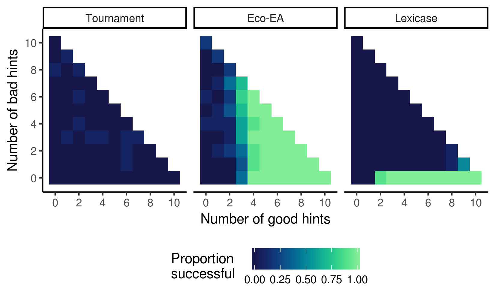

This repository contains all code to generate and analyze data for:

# Applying Ecological Principles to Genetic Programming
#### Chapter in Genetic Programming in Theory and Practice, 2017
*By Emily Dolson, Wolfgang Banzhaf, and Charles Ofria*

#### Summary:

In this chapter, we discuss the importance of ecological dynamics 
in genetic programming (and evolutionary computation more generally) by 
identifying a number of successful approaches that are aleady taking
advantage of them in various forms. 

In particular we discuss the idea of "ecologically-mediated hints":
suggestions about how to solve the problem, provided by associating them
with ecological niches. We explore the trade-offs of providing these
hints via two different algorithms: Lexicase selection and Eco-EA. We find
that Lexicase selection performs better in cases where all of the hints are
accurate. When some hints are misleading, however, Eco-EA outperforms
Lexicase selection.

#### Interactive dashboard for exploring this paper:

In the process of writing this paper, I put together a simple dashboard for exploring the 
effects of various parameters. The interface is not particularly nice, as it was something
I threw together relatively quickly to test some assumptions. However, in case it is
useful to anybody, it is available here: 
[https://emilydolson.github.io/eco-ea-box/web/eco-ea-box.html](https://emilydolson.github.io/eco-ea-box/web/eco-ea-box.html).

The colored-boxes on the left represent individuals in the population (each row is an individual,
each box is one site in it's genome; red sites are closer to 0, blue/purple sites are closer to 1).
There is a histogram for each site in the genome, displaying the distribution of values for that
site across the population. You can start evolution with the "start" button. The drop-down menu lets
you choose a selection scheme. The text boxes let you enter a value for the corresponding parameter.
Make sure to click the "reset" button after changing any settings. If you do not change a
parameter, it will be set to its default value. The website will interpret clicking on a text
box as changing the parameter, so only click one if you intend to enter a number. n_good and n_bad
control the number of good and bad hints respectively. Good hints will be provided for the first
n_good dimensions, and bad hints for the following n_bad dimensions. These numbers must sum to 10
or less.

#### Repository contents:

* Makefile: for compiling experiment code (`make`) and the interactive dashboard (`make web`)
* config: contains the executable used to run all experiments described in the paper.
* source: contains source code for the experiment. source/box_world.h contains the majority
        of the relevant code. source/native contains the .cc file for compiling a C++ executable.
        source/web contains the .cc file for compiling a javascript executable (for interactive
        dahsboard)
* web: contains the compiled javascript for the interactive dashboard, an html file the loads it,
        and the d3 library to run the data visualizations.
* scripts: contains run_list files listing all of command-line instructions to run these experiments,
           stats.R (an R file to run all of the stats), the figure generated by that R code, the final
           data (all_data.csv), and a script that was used to generate the run_list files.

#### Dependencies:

* [Empirical](https://github.com/devosoft/Empirical): A library of tools for writing scientific software. 
  Necessary for recompiling any of the C++ code. Specifically, the data for this paper were generated 
  using [this fork](https://github.com/emilydolson/Empirical) at commit 0342b5e33fe1faee08868d38ee866dd1c5223c03.
* [Emscripten](http://kripken.github.io/emscripten-site/index.html): For compiling the interactive web version.
* [R](https://www.r-project.org/): For running the stats. Additionally, you will need the readr, dplyr, ggplot2, 
  brglm R packages.
* If you want to run the run_list files, the easiest option is to copy the bash lines and run them however is
  most convenient for you. If you happen to be running them on a computer cluster using the PBS queue system,
  though, you can use [dist_qsub](https://github.com/emilydolson/dist_qsub) to translate them directly to .qsub files.
